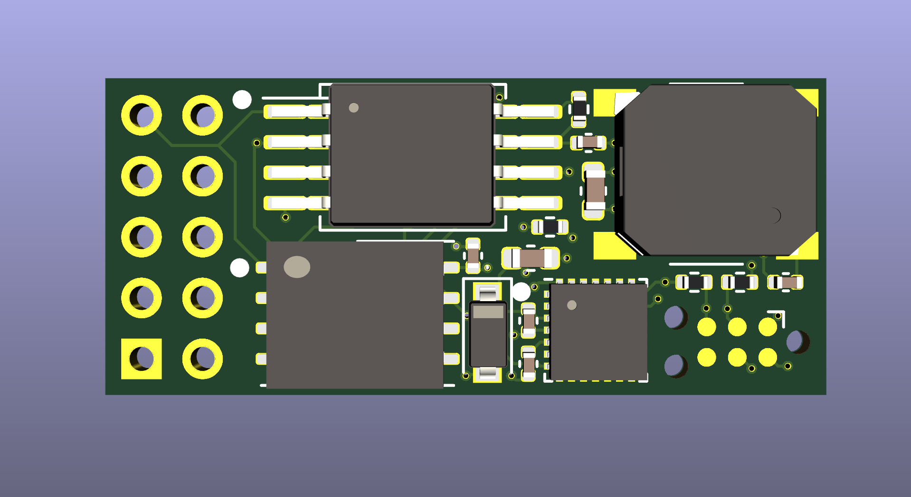

NanoPi R4S NOR flash adapter
============================

This PCB provides the NanoPi R4S with NOR flash as a secondary or primary
boot option.  
Compared to most micro SD cards NOR flash is inherently much more reliable
due to its internal structure. While this comes with its own set of
drawbacks notably small storage size and low write speed it is very well
suited for many appliance applications.  
The dual LAN port configuration of the NanoPi R4S makes it a perfect match
for router operations. This NOR flash adapter module could for example be
paired with OpenWRT to provide a highly reliable router platform.

In addition to the SPI flash this board also features an STM32G031G6U6
microcontroller. It is connected to an I2C bus on the NanoPi R4S.  
The MCU has control over the reset and write protect lines of the SPI NOR
flash chip. Thus it can be used to disable the flash chip if booting from
alternate sources is desired. The write-protect line can be used to
implement custom tamper-proof storage designs.

To notify users of operations performed by the MCU a small dynamic
speaker is provided.

# Ordering

The fabrication files inside `fab` are JLCPCB-ready. I'd suggest ordering
with a 1mm board thickness. This will ensure the easiest fit in small
cases.

The board can be fully assmebled by JLC. The required fabrication files
can also be found in the `fab` directory.  
If you do not plan on using the MCU on the board you can simply unselect
the following components on JLC's website during ordering:

- U5
- D1
- LS1
- C4
- C5
- C6

This will make the boards significantly cheaper, especially when ordering
small quantities.

# Installation

Due to space constraints imposed by many cases the recommended
installation method for this board is to solder it directly to the
expansion header of the NanoPi R4S. Make sure to push the board down onto
the expansion header as far as possible before soldering it into place.
